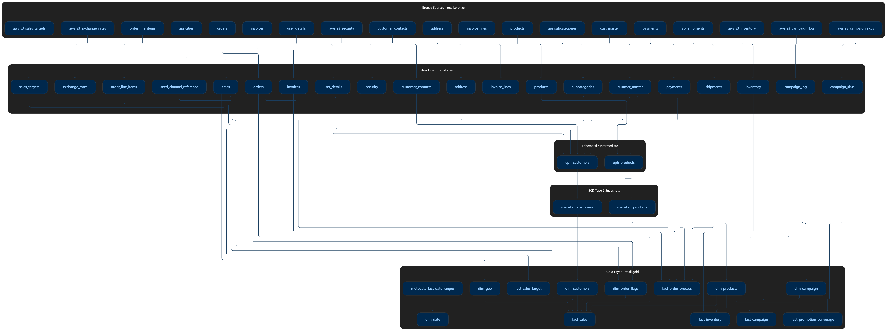

# Omnichannel Retail Data Platform

An end-to-end **modern data engineering and BI platform** built to ingest data from multiple sources, process it through a Databricks Lakehouse using Medallion Architecture, transform it with dbt, orchestrate pipelines with Airflow, and deliver analytics through Power BI.

## 🔗 Live Dashboard

**[View Interactive Power BI Dashboard](https://app.powerbi.com/view?r=eyJrIjoiYWUzN2JlMjktYjYwMS00M2YwLWEzMTQtMjZhNmI2NjIwN2IwIiwidCI6IjIzZGI2ZTA2LTA1YzQtNDg5ZC1iMTM2LWNiYTk0YThlNmYzNiIsImMiOjh9)**

---

## 🏗️ Architecture

```text id="9nqw55"
 PostgreSQL / Neon       S3 Storage       External API
         │                   │                  │
         └──────────────┬────┴──────────────────┘
                        ▼
                  ┌─────────────┐
                  │  Databricks │
                  │  Lakehouse  │
                  └──────┬──────┘
                         ▼
                    🥉 Bronze
                    Raw Data
                         │
                         ▼
                    🥈 Silver
              Cleaned & Standardized
                         │
                         ▼
                    🥇 Gold
                  Star Schema
                         │
                         ▼
                       dbt
                         │
                         ▼
                     Power BI
```

**Apache Airflow** orchestrates the ingestion and Databricks jobs throughout the pipeline.

---

## 🔄 Data Pipeline

1. **Ingestion** — PostgreSQL, S3 and API data are loaded into Databricks.
2. **Bronze** — Raw source data is stored in Delta tables.
3. **Silver** — Data is cleaned and standardized using PySpark.
4. **Gold** — dbt builds the analytical Star Schema.
5. **Orchestration** — Airflow manages pipeline execution and dependencies.
6. **BI** — Power BI connects to the Gold layer for business reporting.

---

# 📐 Architecture & Data Model

### End-to-End Data Platform


### OLTP Data Model

The PostgreSQL / Neon database represents the operational source system.


### OLAP / Star Schema

The Gold layer is modeled as a dimensional Star Schema for analytical workloads.


### dbt Lineage

dbt manages the transformation dependencies from the Silver layer into the Gold analytical models.



### Airflow Orchestration

Airflow coordinates the execution of the data ingestion and transformation workflow.


> **Note:** Replace the image filenames above with the exact filenames currently stored in the `diagrams/` directory.

---

## 🧱 Data Model

The Gold layer follows a dimensional **Star Schema** with fact and dimension tables covering areas such as:

* Sales & orders
* Customers
* Products
* Geography
* Campaigns
* Inventory
* Order processes

---

## 📊 Power BI Dashboard

The Gold layer is consumed by Power BI to provide interactive business analytics.

### Dashboard Pages

| Page   | Focus                             |
| ------ | --------------------------------- |
| **01** | Executive / Business Overview     |
| **02** | Sales Analysis                    |
| **03** | Customer & Product Analytics      |
| **04** | Operations & Additional Analytics |

Dashboard screenshots are available in the `dashbaord/` directory.

**[→ Open Live Power BI Dashboard](https://app.powerbi.com/view?r=eyJrIjoiYWUzN2JlMjktYjYwMS00M2YwLWEzMTQtMjZhNmI2NjIwN2IwIiwidCI6IjIzZGI2ZTA2LTA1YzQtNDg5ZC1iMTM2LWNiYTk0YThlNmYzNiIsImMiOjh9)**

---

## 🛠️ Technology Stack

| Technology            | Purpose                            |
| --------------------- | ---------------------------------- |
| **Databricks**        | Lakehouse & data processing        |
| **Delta Lake**        | Data storage                       |
| **PySpark**           | Ingestion & transformation         |
| **dbt**               | SQL transformation & data modeling |
| **Apache Airflow**    | Orchestration                      |
| **PostgreSQL / Neon** | OLTP source                        |
| **Amazon S3**         | Object storage                     |
| **REST API**          | External data source               |
| **Power BI**          | Analytics & visualization          |
| **Docker**            | Local Airflow environment          |
| **Python / SQL**      | Data engineering                   |

---

## 📁 Repository Structure

```text
omnichannel_retail_data_platform/
│
├── airflow/              # Airflow DAGs & Docker setup
├── databricks_scripts/   # PySpark ingestion & processing
├── src/                  # Project source code
├── loader/               # Data loading utilities
├── diagrams/             # Architecture & data model diagrams
├── docs/                 # Project documentation
├── dashbaord/            # Power BI dashboard screenshots/assets
│
├── pyproject.toml
├── uv.lock
└── README.md
```

---

## 🎯 Project Goal

Demonstrate a complete **data-to-insight workflow** using modern data engineering technologies:

**Sources → Lakehouse → Medallion Architecture → dbt → Star Schema → Airflow → Power BI**

---

## 👤 Author

**Khaled Gohar**
Data Engineer | Data Analyst | BI Developer

[GitHub](https://github.com/khaled-gohar)

---

## 📜 License

MIT License
